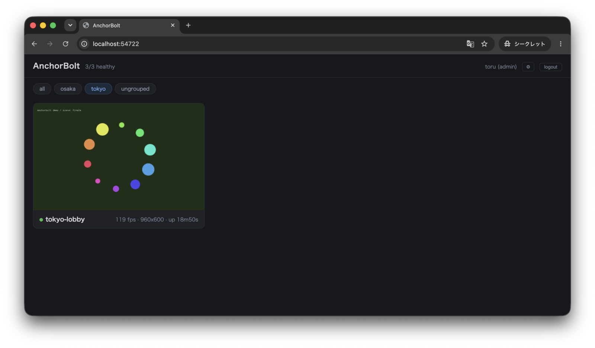
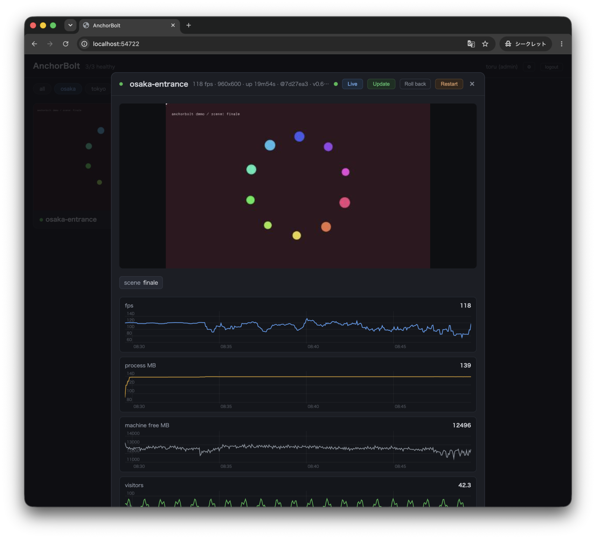
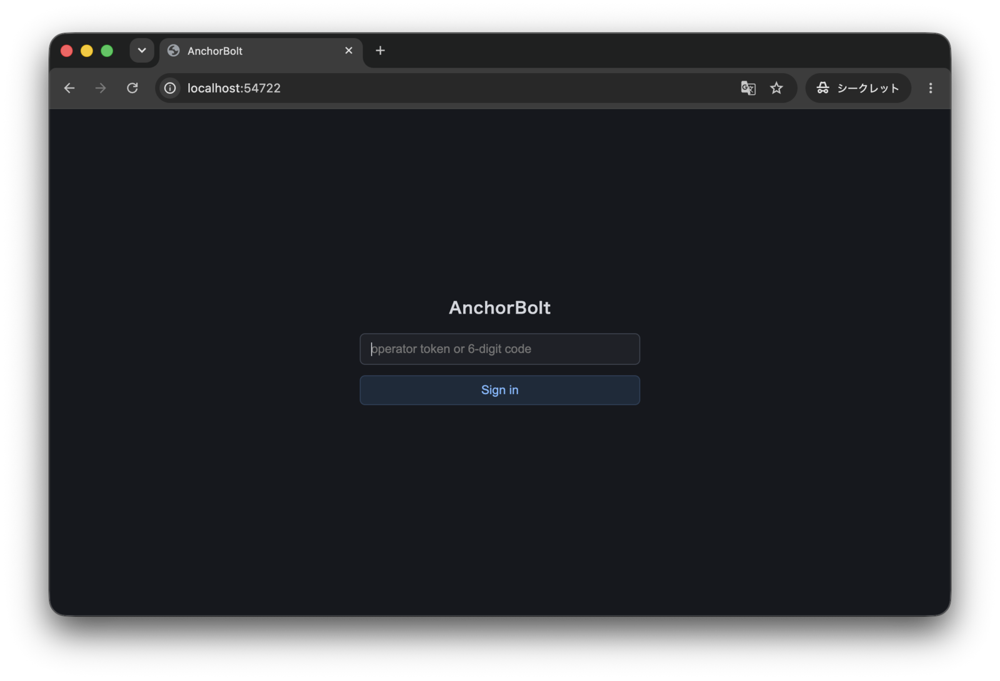
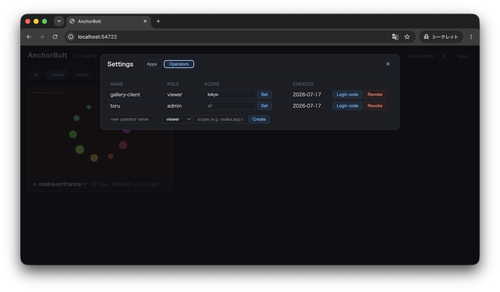
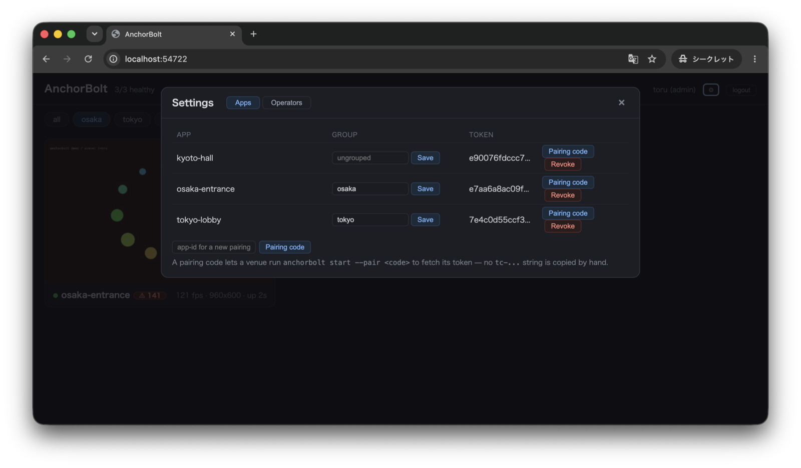
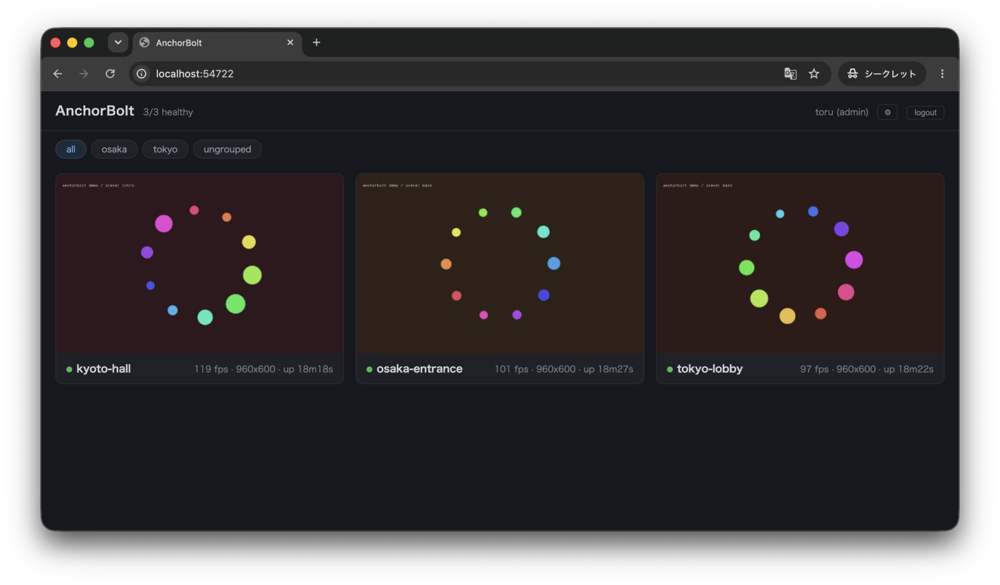
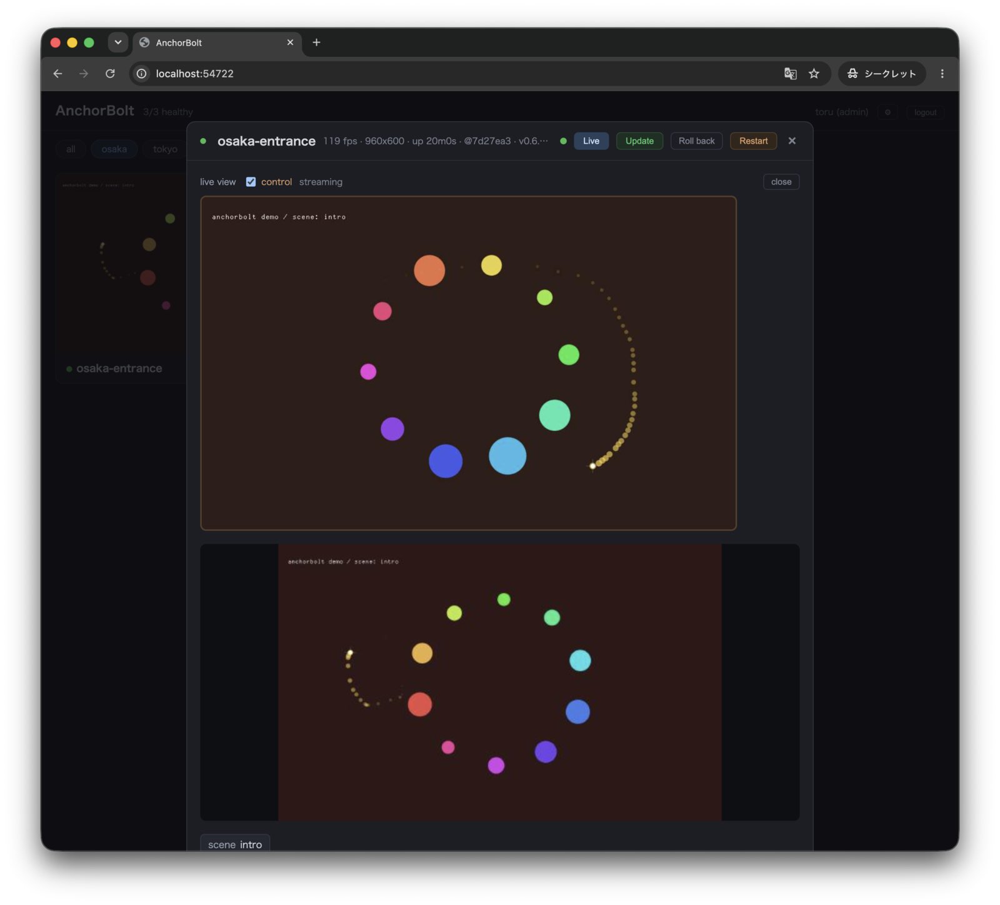

# Get Started

[English](GET_STARTED.md) ・ [← README](../README.ja.md) ・ [Architecture →](ARCHITECTURE.ja.md)

このガイドは、30秒のローカルお試しから実運用デプロイまでを、一歩ずつ進めていきます。すべてのコマンドはコピー＆ペーストで実行でき、必要が満たされたところで止めて構いません。

- [1. ローカルで試す（30秒）](#1-ローカルで試す30秒)
- [2. ダッシュボードを足す](#2-ダッシュボードを足す)
- [3. 公開する前にダッシュボードに鍵をかける](#3-公開する前にダッシュボードに鍵をかける)
- [4. 会場をグループ化し、クライアントの表示範囲を絞る](#4-会場をグループ化しクライアントの表示範囲を絞る)
- [5. 通知を受け取る（Slack、ntfy など）](#5-通知を受け取るslackntfy-など)
- [6. トンネル越しのリモートコントロール](#6-トンネル越しのリモートコントロール)
- [7. 6桁のコードで会場をペアリングする](#7-6桁のコードで会場をペアリングする)
- [8. サービスとして常駐させる](#8-サービスとして常駐させる)

以降、`myApp` はあなたの TrussC アプリを指します——プロジェクトディレクトリ、`.app` バンドル、あるいは素のバイナリのいずれでも構いません。

---

## 1. ローカルで試す（30秒）

アプリ——プロジェクトディレクトリ、`.app` バンドル、あるいは素のバイナリ——を AnchorBolt に指定すると、それを監視します：

```bash
anchorbolt start -p myApp
```

アプリを落としてみましょう（ウィンドウを閉じるか `kill -9` で）。数秒のうちに AnchorBolt が再起動します。これがコアループです：**設定ゼロで自動再起動**——サーバーもアカウントも不要で、アプリは一行も変わっていません。ログはプラットフォーム慣例のログディレクトリにローカル収集されます。

以降はこの上にダッシュボード、リモートコントロール、通知を重ねていきます。必要なものだけ足してください。

---

## 2. ダッシュボードを足す

到達できるマシン（同じマシン、自宅サーバー、VPS）で `anchorbolt serve` を動かします：

```bash
anchorbolt serve --data ./anchorbolt-data
# → fleet server on http://localhost:54722
```

fleet への参加にはトークンが要ります——open mode は無いので、URL を知っているだけでは誰も入れません。この会場用に1つ発行します（id はここ＝サーバー側で決まります。会場が自分で名乗ることはありません）：

```bash
anchorbolt token agent new osaka-entrance --data ./anchorbolt-data
# → tc-... が一度だけ表示される
```

そして会場をサーバーに向けます。トークンは一度渡せば、次回以降は再利用されます：

```bash
anchorbolt start -p myApp --server http://192.168.1.10:54722 --token tc-...
```

id はトークンから決まります——`--id` はありません。ターミナルでなら `--token` すら省けます：初回はトークンか6桁のペアリングコード（ステップ7）を尋ね、それを記憶するので、次回は `--server` だけで済みます。

**http://localhost:54722/** を開くと、会場がライブサムネイル付きでウォールに現れ、ハートビート、30秒ごとのサムネイル、ログを送信します。カードをクリックすると**詳細ビュー**が開きます：より大きなサムネイル、fps／メモリのグラフ、イベント履歴、検索可能なログパネル。





---

## 3. 公開する前にダッシュボードに鍵をかける

会場側はすでにロックされています：fleet にはトークンが要る（ステップ2）ので、トークン無しに偽のデータを POST したり接続したりはできません。もう一方の扉が**ダッシュボード**です——オペレーターが1人も登録されていないと開放状態で、AI エンドポイントも同様、つまり URL を知っている人なら誰でも全会場を閲覧・再起動できてしまいます。インターネットに公開する前に、まず自分用の admin を作成しましょう：

```bash
# on the server
anchorbolt token operator new toru --role admin --data ./anchorbolt-data
# → op-... が一度だけ表示される。ダッシュボードのログインに貼り付ける。
```

これ以降、ダッシュボードはログインを求めます。その `op-...` トークン（または6桁のログインコード——ステップ7を参照）を貼り付ければログインできます。



ロールは3種類：**viewer**（読み取り専用）、**operator**（＋再起動／アップデート／コントロール）、そして **admin**（＋設定ページのすべて）。いずれも歯車アイコン →**Operators** タブから管理できます。



---

## 4. 会場をグループ化し、クライアントの表示範囲を絞る

会場が数個を超えたら、グループにまとめましょう。歯車アイコン →**Apps** タブを開き、各会場の隣にグループ名を入力して Save します。



ウォールにはグループごとのタブが増えていくので、「osaka」だけ、あるいは「tokyo」だけを見ることができます。



クライアントに、**そのクライアントの**会場だけが見えるログインを渡すには、**スコープ**を指定してオペレーターを作成します——グループ名または `app:<id>` エントリをカンマ区切りで並べたものです：

```bash
anchorbolt token operator new gallery-client --role viewer --scope tokyo
```

これで `gallery-client` には tokyo グループだけが見え、それ以外の会場はすべて（AI エンドポイント経由も含めて）404 になります。スコープを持たないオペレーターはすべてを見られます。

---

## 5. 通知を受け取る（Slack、ntfy など）

会場の設定ファイルに `sinks` 配列を追加します。プリセットがテンプレートを埋めてくれます：

```jsonc
// anchorbolt.json on the venue machine
{
  "app": "./bin/myApp.app/Contents/MacOS/myApp",
  "server": "https://ops.example.com",
  "sinks": [
    { "preset": "slack", "urlFile": "slack.url" },
    { "preset": "ntfy",  "url": "https://ntfy.sh/my-venue-alerts" }
  ]
}
```

これで、クラッシュ、ハング、アップデートの失敗、あるいはアプリが上げたアラートがチャンネルに届きます：

> `[osaka-entrance] restart: app killed by signal 9; restarting`
> `[osaka-entrance] up: app healthy again (restart #1)`

Webhook の URL は秘密情報なので、gitignore したファイル（`urlFile`）か環境変数（`urlEnv`）に保管し、コミットされうる設定にインラインで書かないでください。`uptime-kuma` は特別なプリセットで、*正常な間だけ ping を送る*ため、無音になったときに Kuma が知らせてくれます。

アプリは、たった1行で自前のアラートを上げられます——センサーが抜けた、ヘルプボタンが押された、など：

```cpp
mcp::alert("IR camera disconnected!");
```

このメッセージは同じ sinks と、ダッシュボードのイベント一覧の両方へ流れます。

---

## 6. トンネル越しのリモートコントロール

どこからでも会場に到達できるようにするには、`serve` をリバースプロキシか Cloudflare トンネルの背後に置きます。ダッシュボードは素の HTTP（ポート 54722）ですが、インタラクティブな機能（Restart／Update ボタン、ライブビュー、リモートコントロール）は**別の WebSocket ハブ**（ポート 54723）を使います——なので、そこへのパスをルーティングしてください。

**cloudflared ingress**（同じホスト名をパスで振り分け）：

```yaml
ingress:
  - hostname: ops.example.com
    path: /ws
    service: ws://localhost:54723
  - hostname: ops.example.com
    service: http://localhost:54722
```

**会場側** — 追加は何も要りません：

```bash
anchorbolt start -p myApp --server https://ops.example.com
```

`https://` のサーバーは「前段に TLS 終端プロキシが居る」ことを意味するので、会場は規約に従いハブを `wss://<同じホスト>/ws` で探します——上の ingress と一致します。会場ごとの WS フラグは不要です。（変則的なパスのプロキシだけ `--ws-url wss://host/other` を明示。）

これで詳細ビューに **Live** ボタンが現れます。クリックすると画面を見られ、**control** をオンにすればアプリを操作できます——クリック、ドラッグ、キー入力がそのままアプリへ届きます。



リモートコントロールに必要なのは、operator ロール（サーバー側）と、アプリが `mcp::registerDebuggerTools()` でオプトインしていること——これがゲートのすべてで、会場側フラグは不要です。control トグルはアプリが入力ツールを出しているときだけ現れます。監視だけなら HTTP のルートだけで足ります。

> リモートアップデートはデフォルトで operator に許可されています——詳細ビューの **Update** ボタンが、アプリを動かしたまま会場マシン上で `git pull` ＋リビルドを実行し、成功したときだけ切り替えます。絶対に遠隔更新されたくない会場は `--deny-update` でオプトアウトします。

---

## 7. 6桁のコードで会場をペアリングする

`tc-...` の文字列を会場へコピーするのは間違いのもとです。代わりに、設定ページ（**Apps** タブ →*Pairing code*）で**ペアリングコード**を発行し、その6桁を現地にいる人へ読み上げます：

```bash
anchorbolt start -p myApp --server https://ops.example.com --pair 483201
```

このコード（有効期限10分、使い切り）は会場の本物のトークンと引き換えられ、そのトークンはマシン上に非公開で保存されます——だから次回以降の実行では `--pair` も `--token` も要りません。ターミナルでなら `--pair` すら省けます：`--server` だけで起動すると AnchorBolt がコードを尋ねてきます。同じ仕組みが**ログインコード**にもなります：オペレーター用に1つ発行すれば、長いトークンを貼り付ける代わりに、6桁を入力するだけでサインインできます。

---

## 8. サービスとして常駐させる

恒久的なインストールでは、すべてを設定ファイルにまとめ、OS に起動させます。`anchorbolt start --generate-config` でコメント付きのテンプレートを出力できます。`anchorbolt.json` の隣で `anchorbolt start` を実行すると、自動でそれを読み込みます：

```jsonc
{
  "app": "./bin/myApp.app/Contents/MacOS/myApp",
  "args": ["--fullscreen"],
  "server": "https://ops.example.com",
  "tokenFile": "osaka.token",
  "watchdogTimeout": 10,
  "sinks": [ { "preset": "slack", "urlFile": "slack.url" } ]
}
```

`id` キーはありません——id はトークンから決まります。`tokenFile` は `tc-...` トークンを収めた gitignore 済みファイルを指します。あるいは一度ペアリング（ステップ7）すれば省略できます。

ログはデフォルトでプラットフォーム慣例の場所に出力されます（macOS では `~/Library/Logs/anchorbolt/<id>/`、Linux では `$XDG_STATE_HOME/anchorbolt/<id>/`、Windows では `%LOCALAPPDATA%\anchorbolt\<id>\`）——これは launchd/systemd 下で作業ディレクトリが `/` になっても問題ありません。`anchorbolt start` を launchd の plist か systemd のユニットで包めば完成です。AnchorBolt がアプリの面倒を見て、launchd/systemd が AnchorBolt の面倒を見ます。

すべてのフラグについては `anchorbolt --help` を実行してください。この裏側の設計については、[Architecture ドキュメント](ARCHITECTURE.ja.md)を読んでください。
